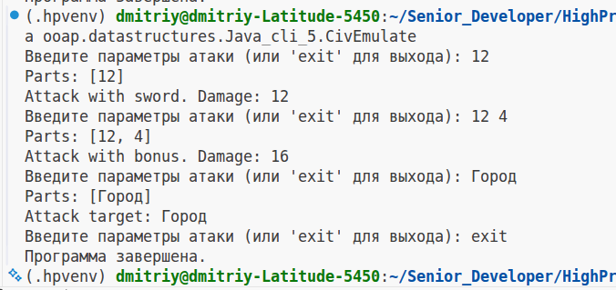

# Отчет по работе с командной строкой Java

## Классы:
Созданы три класса:
- CivEmulate -- класс вызова основного кода,
- SwordsMan -- класс-наследник класса Unit,
- Unit -- класс база для юнитов.

## Компиляция:
### Подготовка классов:
Классы помещены в модуль `ooap.datastructures.Java_cli_5` (корневая директория `src/main/java`). Каждый класс в файле, имена класса и файла совпадают.

```
src/main/java
|-ooap.datastructures.Java_cli_5

project/
├── src/main/java
│   └── ooap.datastructures.Java_cli_5
...     ├── CivEmulate.java
        ├── SwordsMan.java
        └── Unit.java
```

### Компиляция:
Для компиляции кода нужно запустить команду компиляции всех java-файлов в директории модуля

```bash
cd src/main/java/ooap/datastructures/Java_cli_5/
javac *.java
```

За тем можно запустить программу из корневой директории для кода

```bash
cd src/main/java/
java ooap.datastructures.Java_cli_5.CivEmulate 
```

## Работа программы:
В цикле опрашиваем объект Scanner. При выходе из цикла Scanner закрывается.

В поле ввода мы ждем или число, или два числа, или строку. После чего ввод парсится и передатся в полиморфный метод `attack()`, результат выводится в консоль.

