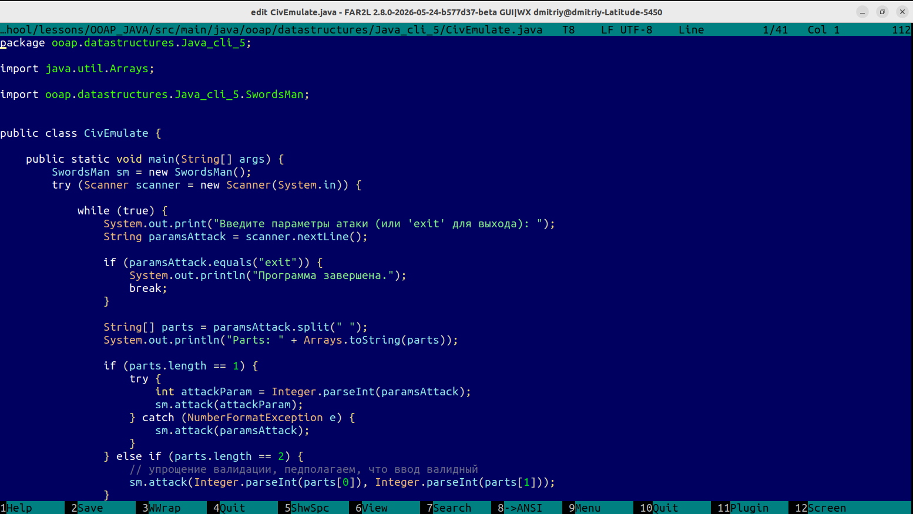
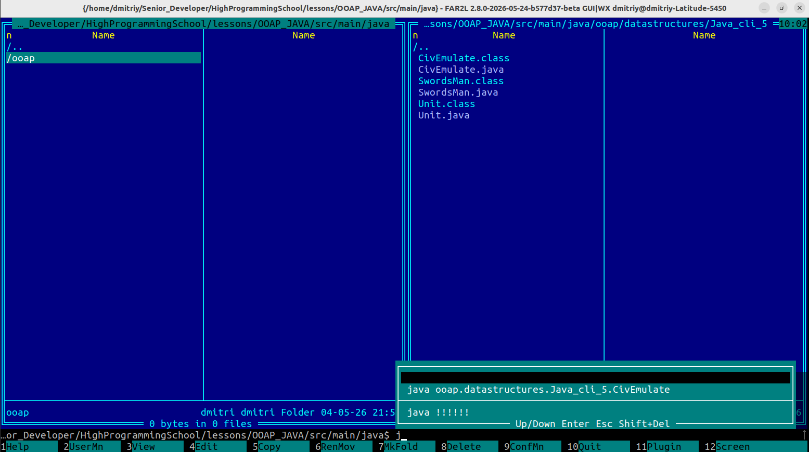
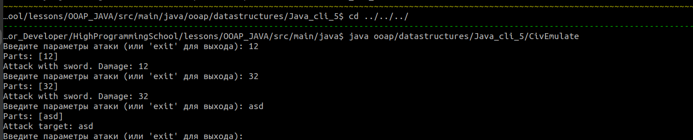

# FAR

## Встроенный редактор
Действительно, во встроенном редакторе есть подсветка синтаксиса

## Запуск Java-файла

Запуск осуществляется так же, как и из терминала. Но в терминале Убунты или VSC автодополнение пути работает привычнее. В стандартном исполнении Tab не автодополняет, а переключается между панелями.

## Вывод запущенной программы
Переключившись с помощью Ctrl+O не терминальный ввод, можно запустить программы через `java <PATH>`

## PS
Когда-то давно я работал с файлами через NortonCommander, что мне сейчас очень сильно far напомнил :)
